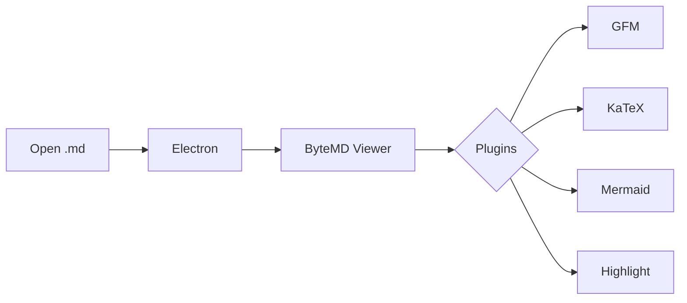
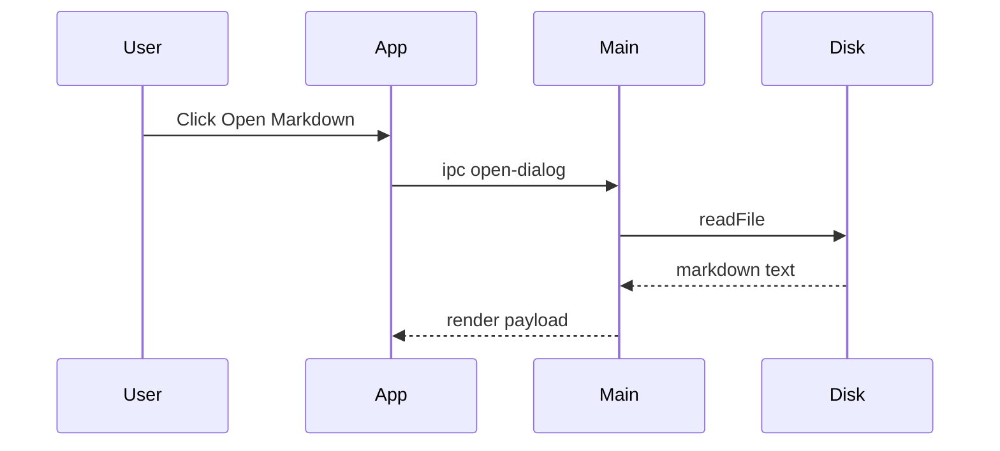

# UGK Markdown Chaos Test :rocket:

这是一份故意写得很乱的 Markdown，用来测试阅读器渲染能力。

line one
line two
line three

---

## 目录

- [文字](#文字)
- [列表](#列表)
- [表格](#表格)
- [代码](#代码)
- [数学公式](#数学公式)
- [Mermaid](#mermaid)
- [HTML](#html)
- [图片](#图片)

## 文字

普通文字，**粗体**，*斜体*，***粗斜体***，~~删除线~~，`inline code`。

> 一级引用
>
> > 二级引用
> >
> > - 引用里的列表
> > - 继续乱

脚注测试：这是一个说法[^note]。

[^note]: 这是脚注内容，看看 GFM 能不能正确显示。

## 列表

- 普通列表
  - 嵌套列表
    - 再嵌套
- 混一点 emoji :smile: :warning: :rocket:

1. 第一项
2. 第二项
3. 第三项

- [x] 已完成任务
- [ ] 未完成任务
- [x] 支持任务列表

## 表格

| 功能 | 输入 | 期望 |
| --- | ---: | :--- |
| GFM | table/task/strike | 正常 |
| Code | fenced block | 高亮 |
| Math | KaTeX | 公式 |
| Mermaid | flowchart | 图 |
| Image | local/remote | 可缩放 |

## 代码

```js
const features = ["gfm", "highlight", "math", "mermaid", "zoom", "emoji"];

function render(markdown) {
  return features.map((feature) => ({
    feature,
    enabled: markdown.includes(feature),
  }));
}

console.log(render("ugk markdown reader"));
```

```python
from dataclasses import dataclass

@dataclass
class Note:
    title: str
    done: bool = False

notes = [Note("render markdown", True), Note("ship app")]
print(notes)
```

```bash
npm run build
npm run smoke
```

## 数学公式

Inline math: $E = mc^2$

Block math:

$$
\int_{-\infty}^{\infty} e^{-x^2} dx = \sqrt{\pi}
$$

矩阵：

$$
\begin{bmatrix}
1 & 2 \\
3 & 4
\end{bmatrix}
\begin{bmatrix}
x \\
y
\end{bmatrix}
=
\begin{bmatrix}
1x + 2y \\
3x + 4y
\end{bmatrix}
$$

## Mermaid





## HTML

<details>
  <summary>点我展开</summary>

  这里是 HTML details 内容。

  <strong>HTML bold</strong> + <code>inline html code</code>
</details>

<div style="border:1px solid #999;padding:12px;border-radius:6px;margin-top:12px">
  这是一段内联 HTML，用来测试 Markdown 里混 HTML 的表现。
</div>

## 图片

远程图片测试，点一下看看 zoom：


## 长段落

这是一个很长很长很长的段落，用来测试阅读宽度、换行、行高、滚动体验。Markdown 阅读器如果只把内容糊在屏幕上，看起来就会很累；好的阅读器应该让段落保持舒服的宽度、代码块不会挤爆、表格可以正常显示、图片不会撑破页面。

## 边角内容

`a_b_c` 不应该乱变成斜体。

URL 自动链接：https://github.com/pd4d10/bytemd

中文、English、123、符号混排：你好 world `const x = 1`，继续测试。

---

结束。
