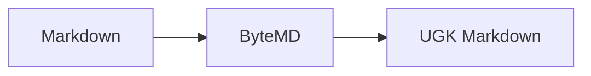

# UGK Markdown Test

- opened from packaged macOS app
- table support via ByteMD GFM

| item | status |
| --- | --- |
| preload | ok |

```js
const rich = true
console.log({ rich })
```

Inline math: $E = mc^2$



:rocket:

line one
line two
